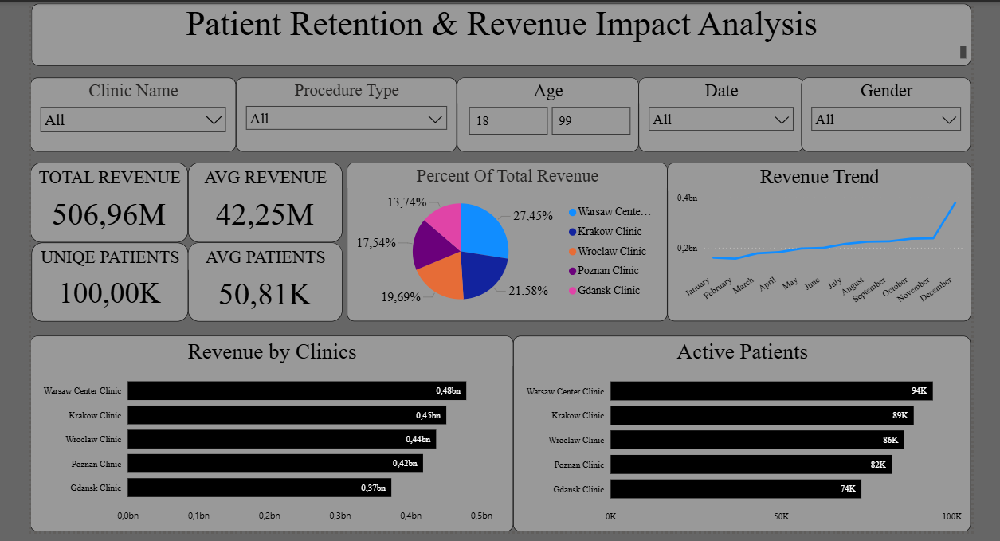
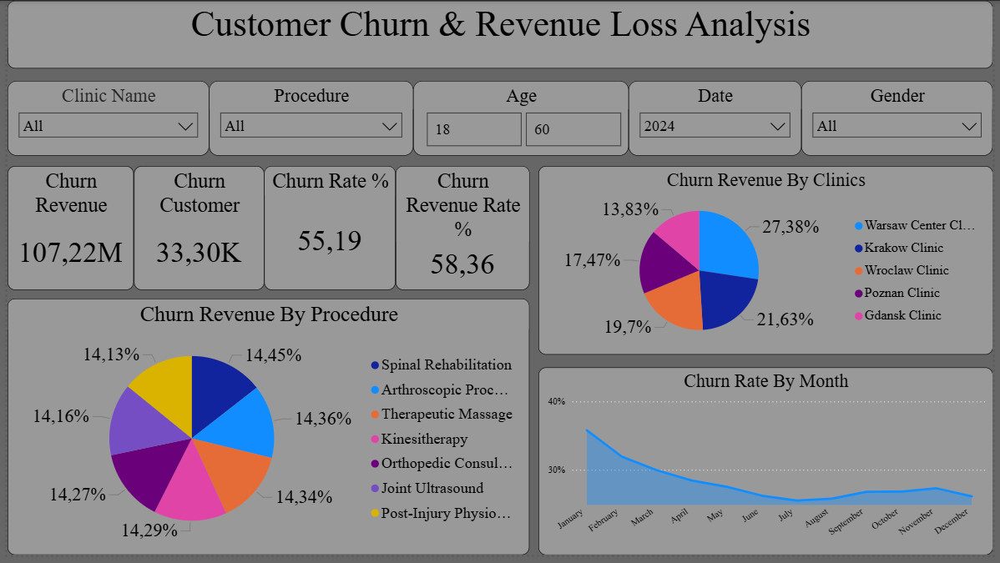
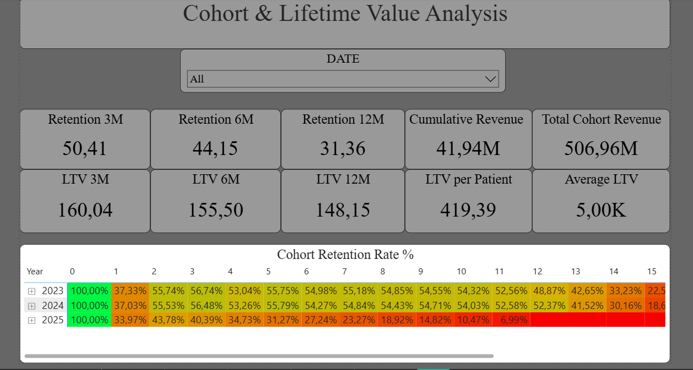
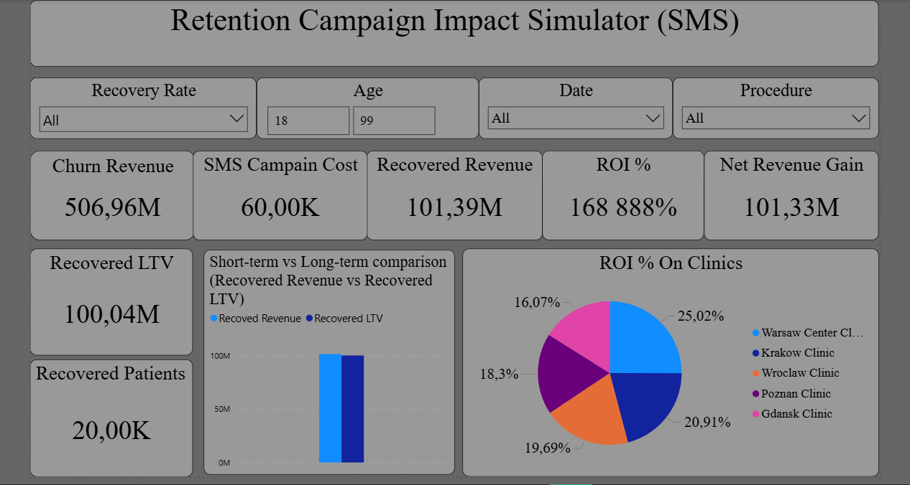
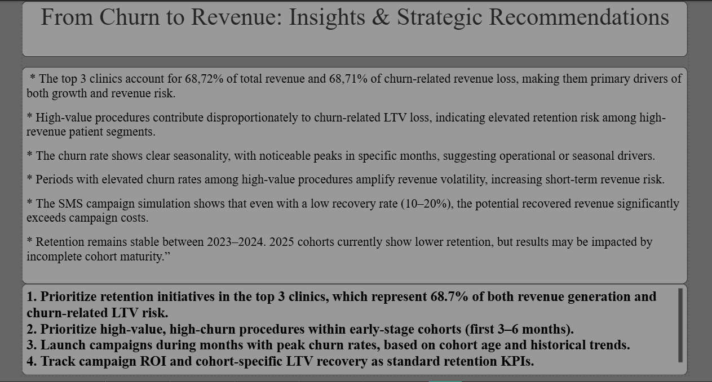

# healthcare-churn-analysis-

## Project Overview :

The goal of this project is to analyze patient churn in a healthcare network and quantify revenue loss caused by churn.
Additionally, the project evaluates the potential ROI of a retention campaign (SMS) under different recovery scenarios.

### Tech Stack :
* SQL (PostgreSQL),
* Power BI,
* DAX,
* Python (faker)

### Data model :
* clinics.csv,
* patient_visits.csv (900k rekords),
* procedure.csv
  
 Monthly grain was chosen to align churn definition with business reporting cycles.

### Cohort & LTV Analysis:
This project tracks patient retention and revenue over time using monthly cohorts. Average Lifetime Value (LTV) is calculated per patient and aggregated by cohort to identify high-value segments and retention risk. This enables targeted retention campaigns and prioritization of high-impact clinics and procedures.

### Key Outcomes (bullet points)
* Identified top churn-driving clinics and procedures, highlighting high-risk segments for targeted interventions
* Quantified churn-related revenue loss (≈ X mln) and tracked it by cohort and procedure
* Calculated Average Lifetime Value (LTV) per patient and monitored retention trends across cohorts
* Simulated SMS retention campaigns with dynamic recovery rates (10–20%), showing potential ROI vs. campaign cost
* Delivered actionable business recommendations to improve retention and maximize revenue recovery

## Power BI Dashboard – Preview

### 1. Executive Overview


### 2. Churn Analysis


### 4. Cohort Analysis


### 4. SMS Campaign Simulation


### 5. Business Insights & Recommendations



## Project Structure

```text
healthcare-churn-analysis/
│
├── README.md                  ← Project overview (for recruiters)
│
│
├── sql/
│   ├── 01_base_tables.sql
│   ├── 02_monthly_aggregation.sql
│   ├── 03_churn_identification.sql
│   ├── 04_cohort_base.sql
│   ├── 05_cohort_activity.sql
│   ├── 06_cohort_age.sql
│   ├── 07_cohort_retention.sql
│   └── informations.md              ← SQL logic explained
│
├── dax/
│   ├── 01_churn_measures.dax
│   ├── 02_revenue_measures.dax
│   ├── 03_cohort_measure.dax
│   ├── 04_campaign_simulation.dax
│   └── informations.md              ← DAX measures explained
│
├── powerbi/
│     ├── Patient Retention & Revenue Impact Analysis.pbix
│     ├── informations.md
│     └── dashboard_screenshot/
│            ├── 01_overview.png
│            ├── 02_churn_analysis.png
│            ├── 03_sms_campaign_simulation.png
│            └── 04_insights.png
│
├── insights/
│   └── insights_and_recommendations.md
│
└── assumptions_and_limitations.md
    └── informations.md
