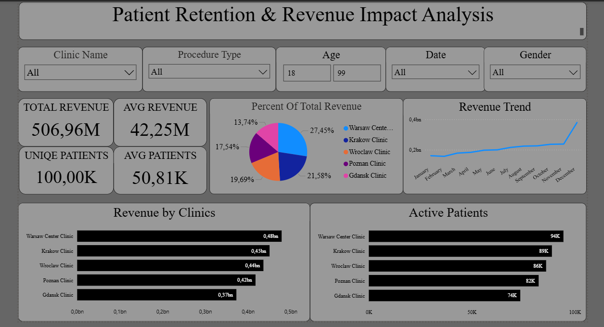
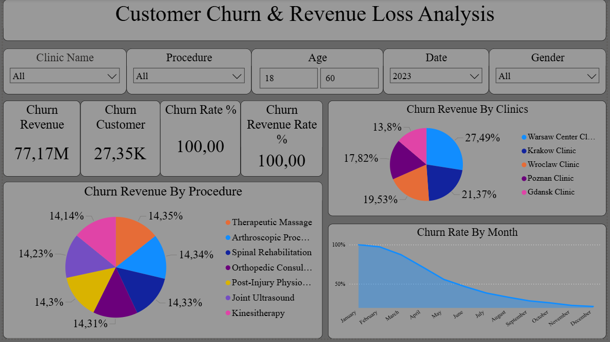
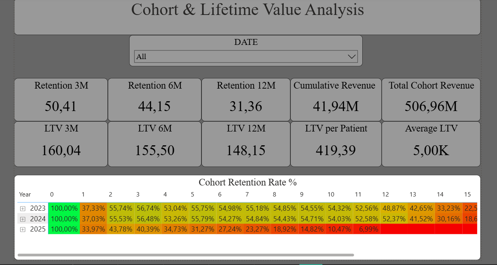
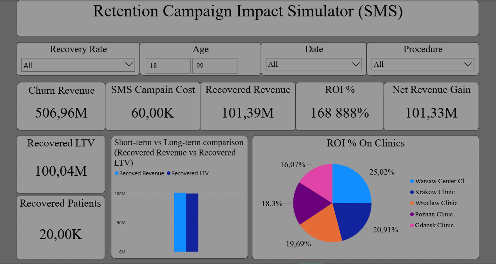
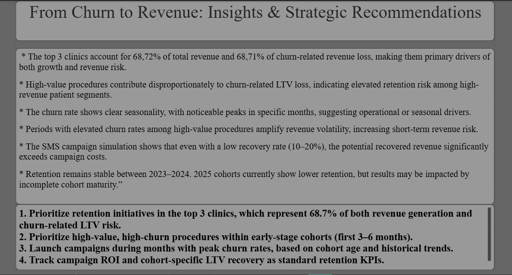

# healthcare-churn-analysis

## Project Overview 

The goal of this project is to analyze patient churn within a healthcare network and quantify the revenue loss associated with patients discontinuing their visits.

The analysis includes cohort-based retention analysis and patient lifetime value (LTV) estimation to better understand long-term patient behavior and revenue contribution. These insights are used to identify churn patterns and evaluate the financial impact of patient attrition.

Additionally, the project simulates the potential ROI of an SMS retention campaign, estimating how recovering a portion of churned patients could improve total revenue.

## Business Problem

Healthcare providers often struggle to identify patients who stop visiting clinics, which leads to significant revenue loss. 
Understanding patient churn patterns and identifying high-value patient segments is crucial for designing effective retention strategies.

This project analyzes patient activity data to identify churn behavior, estimate the financial impact of lost patients, and evaluate whether targeted retention campaigns could recover revenue.

## Data Processing Pipeline

1. Raw CSV data is loaded into PostgreSQL.
2. Monthly patient activity is aggregated from visit-level data.
3. Churn is identified based on inactivity in the following month.
4. Cohort tables are built to analyze retention trends.
5. Lifetime Value (LTV) metrics are calculated per patient and cohort.
6. Power BI is used to visualize churn KPIs, cohort retention, and revenue impact.
7. SMS campaign scenarios simulate potential revenue recovery.


### Tech Stack :
* SQL (PostgreSQL),
* Power BI,
* DAX,
* Python (faker)
SQL is used for data transformation and churn modeling, while Power BI is used to visualize key KPIs, retention cohorts, and revenue impact.

### Data model :
* clinics.csv,
* patient_visits.csv (~900k records),
* procedure.csv
  
 Monthly grain was chosen to align churn definition with business reporting cycles.

### Cohort & LTV Analysis

Patients are grouped into monthly cohorts based on their first visit. 
Retention rates are tracked across subsequent months to understand how patient engagement evolves over time.

Average Patient Lifetime Value (LTV) is calculated to estimate long-term revenue contribution and identify high-value patient segments. This allows prioritization of clinics and procedures with the greatest retention impact.


### Key Outcomes (bullet points)
* Identified top churn-driving clinics and procedures, highlighting high-risk segments for targeted interventions
* Quantified churn-related revenue loss (≈ X million) and tracked it by cohort and procedure
* Calculated Average Lifetime Value (LTV) per patient and monitored retention trends across cohorts
* Simulated SMS retention campaigns with dynamic recovery rates (10–20%), showing potential ROI vs. campaign cost
* Delivered actionable business recommendations to improve retention and maximize revenue recovery

## Architecture Diagram 

                                                CSV Data
                                                   ↓
                                          PostgreSQL Database
                                                   ↓
                                  SQL Views (Churn + Cohort Modeling)
                                                   ↓
                                 Power BI Semantic Layer (DAX Measures)
                                                   ↓
                                Interactive Dashboards & Business Insights


## Power BI Dashboard – Preview

### 1. Executive Overview


### 2. Churn Analysis


### 3. Cohort Analysis


### 4. SMS Campaign Simulation


### 5. Business Insights & Recommendations



## Project Structure

```text
healthcare-churn-analysis/
│
├── README.md                  ← Project overview (for recruiters)
│
├── sql/
│   ├── 01_base_tables.sql
│   ├── 02_monthly_aggregation.sql
│   ├── 03_churn_identification.sql
│   ├── 04_cohort_base.sql
│   ├── 05_cohort_activity.sql
│   ├── 06_cohort_age.sql
│   ├── 07_cohort_retention.sql
│   └── informations.md              ← SQL logic explained
│
├── dax/
│   ├── 01_churn_measures.dax
│   ├── 02_revenue_measures.dax
│   ├── 03_cohort_measure.dax
│   ├── 04_campaign_simulation.dax
│   └── informations.md              ← DAX measures explained
│
├── powerbi/
│     ├── Patient Retention & Revenue Impact Analysis.pbix
│     ├── informations.md
│     └── dashboard_screenshot/
│            ├── 01_overview.png
│            ├── 02_churn_analysis.png
│            ├── 03_cohort_analysis.png
│            ├── 04_sms_campaign_simulation.png
│            └── 05_insights.png
│
├── insights/
│   └── insights_and_recommendations.md
│
└── assumptions_and_limitations.md
    └── informations.md
